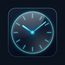

<div align="center">



# Clockly

**A beautiful, lightweight time management suite for Linux**

[](LICENSE)
[](https://tauri.app)
[](#installation)

</div>

---

## Overview

Clockly is a native Linux desktop application built with **Tauri 2** and pure **HTML/CSS/JavaScript** — no frameworks, no bloat. It runs on the system's built-in WebKit engine, keeping it fast and tiny.

**Features:**
- 🕐 **Clock** — Live clock with 12/24h format, timezone selector, and World Clock panel
- ⏰ **Alarm** — Set repeating alarms with day selection and custom labels
- ⏱️ **Timer** — Countdown timer with quick presets (Pomodoro, Deep Focus, etc.)
- ⏲️ **Stopwatch** — Lap timer with stats (lap count, average lap time)
- ✅ **Tasks** — Sidebar task list, persisted in LocalStorage
- 🎨 **Themes** — Dark/Light mode + 12 accent color options
- 💾 **Offline-first** — All data stored locally, no network required

---

## Project Structure

```
Clockly/
├── website/                   # Web source files (HTML, CSS, JavaScript)
│   ├── index.html             #   App shell & all UI markup
│   ├── style.css              #   Design system, tokens, component styles
│   └── script.js              #   All app logic (clock, alarm, timer, etc.)
│
├── src-tauri/                 # Tauri / Rust backend
│   ├── tauri.conf.json        #   App configuration (window, bundle, icons)
│   ├── Cargo.toml             #   Rust dependencies + release optimizations
│   ├── build.rs               #   Tauri build script (required)
│   ├── src/
│   │   ├── main.rs            #   Binary entry point
│   │   └── lib.rs             #   App initialization & plugin registration
│   └── icons/                 #   App icons for all platforms
│       ├── 32x32.png
│       ├── 128x128.png
│       ├── 128x128@2x.png
│       ├── icon.png           #   512×512 source icon
│       ├── icon.ico           #   Windows multi-size icon
│       └── icon.icns          #   macOS icon
│
├── package.json               # npm scripts (dev / build)
├── package-lock.json
├── .gitignore
└── README.md
```

---

## Installation

Download the latest release for your distro from the [Releases](https://github.com/bluewizardz/clockly/releases) page.

### Ubuntu / Debian / Linux Mint
```bash
sudo dpkg -i Clockly_1.0.0_amd64.deb
```

### Fedora / RHEL / openSUSE
```bash
sudo rpm -i Clockly-1.0.0-1.x86_64.rpm
```

### Arch Linux / Any distro (AppImage)
```bash
chmod +x Clockly_1.0.0_amd64.AppImage
./Clockly_1.0.0_amd64.AppImage
```

> **Tip for Arch users:** You can also place the AppImage in `~/.local/bin/` and create a `.desktop` entry for it to appear in your launcher.

---

## Building from Source

### Prerequisites

| Dependency | Install |
|-----------|---------|
| **Rust** (stable) | `curl --proto '=https' --tlsv1.2 -sSf https://sh.rustup.rs \| sh` |
| **Node.js** ≥ 18 | Via your distro's package manager or [nodejs.org](https://nodejs.org) |
| **WebKit2GTK 4.1** | See table below |

#### System Libraries by Distro

**Ubuntu / Debian:**
```bash
sudo apt-get install libwebkit2gtk-4.1-dev libgtk-3-dev \
  libayatana-appindicator3-dev librsvg2-dev patchelf
```

**Fedora:**
```bash
sudo dnf install webkit2gtk4.1-devel gtk3-devel \
  libayatana-appindicator-gtk3-devel librsvg2-devel patchelf
```

**Arch Linux:**
```bash
sudo pacman -S webkit2gtk-4.1 gtk3 libayatana-appindicator \
  librsvg patchelf
```

---

### Development (live preview)

```bash
# 1. Clone the repo
git clone https://github.com/bluewizardz/clockly.git
cd clockly

# 2. Add Rust to PATH (if freshly installed)
. ~/.cargo/env

# 3. Install Tauri CLI
npm install

# 4. Start in dev mode — opens native window with hot-reload
npm run dev
```

> **Note:** The first `npm run dev` compiles the Rust backend from scratch (~5 min). Subsequent runs are near-instant.

---

### Production Build

```bash
. ~/.cargo/env
npm run build
```

Output packages appear in `src-tauri/target/release/bundle/`:

| Format | Path | Distro |
|--------|------|--------|
| `.deb` | `bundle/deb/Clockly_1.0.0_amd64.deb` | Ubuntu, Debian, Mint |
| `.rpm` | `bundle/rpm/Clockly-1.0.0-1.x86_64.rpm` | Fedora, RHEL, openSUSE |
| `.AppImage` | `bundle/appimage/Clockly_1.0.0_amd64.AppImage` | Arch + any Linux |

> The first production build takes **~15 minutes** (Rust compiles with full optimizations). Incremental rebuilds are much faster.

---

## Why Tauri? (vs Electron)

| | **Clockly (Tauri)** | Electron app |
|---|---|---|
| Binary size | ~2 MB | ~150 MB |
| RAM at startup | ~30–60 MB | ~150–300 MB |
| Engine | System WebKit | Bundled Chromium |
| Rust backend | ✅ | ❌ |
| Native packaging | .deb / .rpm / AppImage | .deb / .AppImage |

---

## Editing the Web UI

All visible UI is in the `website/` folder — no build step required for web changes:

```
website/
├── index.html   ← All markup: pages, modals, sidebar, nav
├── style.css    ← CSS variables (design tokens), all component styles
└── script.js    ← All JavaScript: clock logic, alarms, timer, tasks
```

**Workflow for UI changes:**
1. Edit files in `website/`
2. Run `npm run dev` to see changes live in the native window
3. Run `npm run build` when ready to ship a new package

---

## Settings & Data

All user preferences are stored in the browser's **LocalStorage** inside the Tauri WebView:

| Key | Value |
|-----|-------|
| `clockly-theme` | `"dark"` or `"light"` |
| `clockly-format` | `"12"` or `"24"` |
| `clockly-timezone` | IANA timezone string, e.g. `"Asia/Kolkata"` |
| `clockly-accent` | Accent color name, e.g. `"blue"` |
| `clockly-alarms` | JSON array of alarm objects |
| `clockly-tasks` | JSON array of task objects |

Data is never sent anywhere — it lives entirely on your device.

---

## License

MIT © [bluewizardz](https://github.com/bluewizardz)
